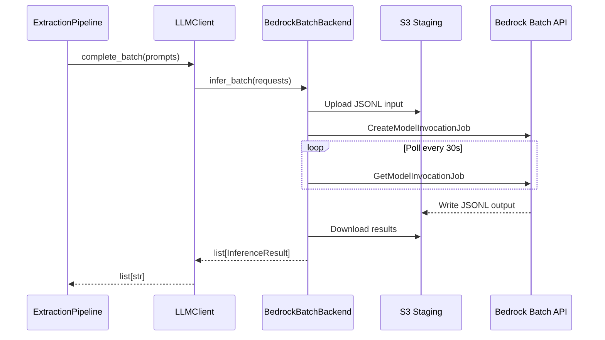
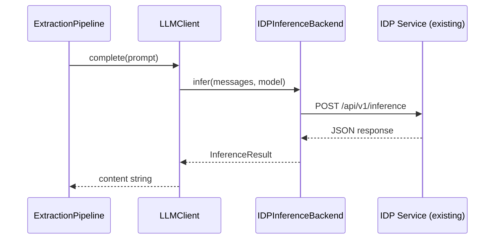

# Architecture: Pluggable Inference Backend Layer

> **Audience**: Ameritas engineering, architecture, product, and leadership teams evaluating Scout AI as the enterprise seed project for document intelligence.

---

## Executive Summary

Every AI-powered service at Ameritas makes LLM calls. Today, each project hardcodes its own inference path — direct API calls to OpenAI, custom Bedrock wrappers, bespoke retry logic, inconsistent error handling. When the infrastructure team wants to migrate from real-time inference to Bedrock Batch (which is ~50% cheaper for bulk workloads), every project needs surgery.

Scout AI solves this with a **pluggable inference layer**: a single Protocol contract that all LLM calls flow through, a built-in real-time backend that preserves current behavior, and a factory that loads external backends from a dotted-path string configured via one environment variable. No code changes. No redeployments of Scout AI itself.

This is not a framework — it's a **contract and a default**. Scout AI ships the interface and the real-time implementation. External projects (Bedrock Batch pipeline, IDP adapters, SageMaker endpoints) ship their own backends that conform to the same contract. Every team that forks Scout AI inherits this capability for free.

### What This Enables

```
┌─────────────────────────────────────────────────────────────────────┐
│                        Scout AI (Seed Project)                      │
│                                                                     │
│   IInferenceBackend Protocol ──── RealTimeBackend (built-in)       │
│          │                                                          │
│          │  One env var switches the backend:                       │
│          │  SCOUT_LLM_INFERENCE_BACKEND=realtime                   │
│          │  SCOUT_LLM_INFERENCE_BACKEND=mypackage.mod:MyBackend    │
│          │                                                          │
├──────────┼──────────────────────────────────────────────────────────┤
│          │         External Projects (never touch Scout AI)         │
│          │                                                          │
│          ├── ameritas_bedrock_batch.backend:BedrockBatchBackend     │
│          ├── ameritas_idp.adapter:IDPInferenceBackend               │
│          ├── ameritas_sagemaker.backend:SageMakerBackend            │
│          └── (any future inference service)                         │
└─────────────────────────────────────────────────────────────────────┘
```

### Enterprise Value Proposition

| Dimension | Before (Hardcoded) | After (Pluggable) |
|-----------|--------------------|--------------------|
| **Cost** | Real-time only; no batch pricing | Bedrock Batch at ~50% cost reduction for bulk |
| **Deployment flexibility** | One inference path per project | Swap backends per environment (dev/staging/prod) |
| **Time to integrate** | Weeks per project to add batch support | One env var change; backend project is independent |
| **Standardization** | Each team writes own retry/error/logging | One contract, consistent behavior everywhere |
| **Risk** | Breaking changes cascade across projects | Backend changes are isolated; Scout AI is stable |

---

## Architecture Decision Records

### ADR-001: Protocol Over Abstract Base Class

**Status**: Accepted

**Context**: Scout AI needs an abstraction for inference backends that external projects can implement without importing or depending on Scout AI. The codebase already uses this pattern for persistence (`IPersistenceBackend` in `persistence/protocols.py`).

**Decision**: Use Python's `typing.Protocol` with `@runtime_checkable` instead of an ABC.

**Consequences**:
- External backends use **structural subtyping** (duck typing) — they just implement `infer()` and `infer_batch()` methods with the right signatures. No inheritance required.
- External packages do **not need Scout AI as a dependency** to build a backend. They can type-check against their own copy of the Protocol or simply match the method signatures.
- `isinstance(backend, IInferenceBackend)` works at test time thanks to `@runtime_checkable`, catching protocol violations before deployment.
- Consistent with `IPersistenceBackend` — developers learn one pattern and apply it everywhere.

**Alternatives Considered**:
- **ABC (Abstract Base Class)**: Forces `import scout_ai` in every backend project. Creates a circular dependency risk and couples external projects to Scout AI's release cycle. Rejected.
- **No abstraction (just functions)**: Loses the ability to carry state (connection pools, batch job handles, credentials). Rejected.
- **Plugin registry with entry points**: Over-engineered for the use case. Entry points require packaging metadata (`pyproject.toml` extras) and are harder to debug than a simple dotted-path string. Rejected.

---

### ADR-002: Factory With Dotted-Path Loading

**Status**: Accepted

**Context**: The system needs to instantiate the correct backend class at startup. The class might be built-in (`RealTimeBackend`) or live in an external package installed alongside Scout AI.

**Decision**: Use a factory function (`create_inference_backend()`) that checks for the string `"realtime"` and falls back to `_import_dotted_path()` for any other value. The dotted path uses `module.path:ClassName` syntax.

**Consequences**:
- **One env var** (`SCOUT_LLM_INFERENCE_BACKEND`) controls the entire inference strategy. No config files, no registry setup, no plugin manifests.
- Reuses the existing `_import_dotted_path()` helper from `domains/registry.py` — zero new import machinery.
- External backends receive the full `AppSettings` object, so they can self-configure from any config group (LLM settings, persistence, observability, etc.).
- Import errors surface immediately at startup with clear tracebacks, not at first inference call.

**Alternatives Considered**:
- **Enum-based registry** (`"bedrock_batch"` → hardcoded import): Requires Scout AI to know about every backend at compile time. Violates the open/closed principle. Rejected.
- **setuptools entry points**: Standard Python plugin mechanism, but requires backend authors to configure `[project.entry-points]` in their `pyproject.toml`. Over-complicated for an internal tool where dotted paths are clear and debuggable. Rejected.
- **Dependency injection container** (e.g., `injector`, `dependency-injector`): Adds a framework dependency for a problem solved by 10 lines of import code. Rejected.

---

### ADR-003: Ship Exactly One Built-In Backend

**Status**: Accepted

**Context**: Scout AI could ship multiple backends (real-time, batch, mock) or just one. The Bedrock Batch backend requires AWS-specific dependencies (`boto3`, batch job management, S3 staging) that not every team needs.

**Decision**: Ship only `RealTimeBackend` inside Scout AI. All other backends (Bedrock Batch, IDP, SageMaker) live in separate projects with their own dependencies and release cycles.

**Consequences**:
- Scout AI's dependency footprint stays minimal — no `boto3` requirement for teams using OpenAI or Ollama.
- Backend projects can release independently. A Bedrock Batch bug fix doesn't require a Scout AI release.
- Clear ownership: the infrastructure team owns the Bedrock Batch backend; the IDP team owns the IDP adapter; Scout AI owns the contract.
- `FakeInferenceBackend` in `tests/fakes/` provides a canned-response backend for testing — no real LLM calls needed.

**Alternatives Considered**:
- **Ship all backends in Scout AI**: Creates a monolith with everyone's dependencies. A Bedrock Batch change risks breaking the IDP path. Rejected.
- **Ship no backends (pure abstraction)**: Forces every project to implement their own real-time backend, duplicating the litellm wrapper. Rejected — the 80/20 rule says ship the common case.

---

### ADR-004: Backward-Compatible Injection via None Sentinel

**Status**: Accepted

**Context**: `LLMClient` is used throughout the codebase — in providers, services, and orchestrators. Changing its constructor signature risks breaking existing callers.

**Decision**: Add an optional `backend: IInferenceBackend | None = None` parameter to `LLMClient.__init__()`. When `None`, the existing inline `litellm.acompletion()` code path runs unchanged. When a backend is provided, `complete_with_finish_reason()` and `complete_batch()` delegate to it.

**Consequences**:
- **Zero regressions**: All 416 existing tests pass without modification. Code that constructs `LLMClient(settings)` without a backend argument works exactly as before.
- **Incremental adoption**: Teams can adopt the pluggable backend in one pipeline at a time. The orchestrator factory (`create_extraction_pipeline`) wires the backend automatically; direct `LLMClient` usage can remain unchanged.
- Retry logic, error classification, and message construction stay in `LLMClient` — the backend is only responsible for the raw inference call.
- A `_build_messages()` helper was extracted as part of this change, reducing duplication between the backend-delegated and inline paths.

**Alternatives Considered**:
- **Replace LLMClient entirely**: High risk. LLMClient has JSON extraction, retry logic, and batch semantics that would need reimplementing. Rejected.
- **Mandatory backend (no None path)**: Forces all existing code to update. Breaks backward compatibility for no benefit. Rejected.
- **Separate client class (e.g., PluggableLLMClient)**: Forks the abstraction. Now there are two client classes to maintain and two code paths to test. Rejected.

---

### ADR-005: Async-First Contract

**Status**: Accepted

**Context**: Real-time inference returns in milliseconds to seconds. Batch inference (Bedrock Batch) submits a job and polls for completion over minutes to hours. IDP adapters may call external services with variable latency.

**Decision**: Both `infer()` and `infer_batch()` are `async` methods. Real-time backends `await` the litellm call and return immediately. Batch backends can `await` a polling loop, an SQS message, or a callback — the caller doesn't know or care.

**Consequences**:
- **Uniform calling convention**: The pipeline code (`ExtractionPipeline`, `ScoutRetrieval`, etc.) doesn't branch on backend type. It `await`s the result regardless of whether it took 200ms or 20 minutes.
- Compatible with Python's `asyncio` ecosystem — batch backends can use `asyncio.sleep()` polling, `aioboto3` for S3 status checks, or `asyncio.Event` for callback-driven completion.
- `infer_batch()` accepts `list[InferenceRequest]` with `request_id` fields, enabling batch backends to correlate requests with results even when processing is out-of-order.

**Alternatives Considered**:
- **Sync interface with threading**: Blocks the event loop. Incompatible with the existing async codebase (all providers, hooks, and agents are async). Rejected.
- **Callback/listener pattern**: More complex API surface. Callers need to register handlers instead of simply `await`ing. Rejected for internal tooling where simplicity wins.

---

## Enterprise Impact Analysis

### Reusability

The pluggable inference layer follows the same Protocol pattern as pluggable persistence (`IPersistenceBackend`), domain registration (`DomainRegistry`), and formatter dispatch. Any team forking Scout AI inherits all four pluggable layers:

| Layer | Protocol | Built-In | External |
|-------|----------|----------|----------|
| **Inference** | `IInferenceBackend` | `RealTimeBackend` | Bedrock Batch, IDP, SageMaker |
| **Persistence** | `IPersistenceBackend` | File, S3, Memory | DynamoDB, Redis, etc. |
| **Context** | `IContextCompressor`, `IContextCache` | NoOp, Entropic, Memory | LLMLingua, Redis, S3 cache |
| **Domain** | `DomainConfig` | APS | Workers' Comp, Disability, Dental |
| **Formatting** | `IPDFFormatter` | APS PDF | Custom PDF/JSON/HTML per domain |

This is not accidental — it's a **deliberate architectural pattern** that makes Scout AI a genuine seed project, not just a reference implementation.

### Extensibility

Adding a new inference backend requires:

1. **Create a new Python package** (e.g., `ameritas-bedrock-batch`)
2. **Implement two async methods**: `infer()` and `infer_batch()`
3. **Set one env var**: `SCOUT_LLM_INFERENCE_BACKEND=ameritas_bedrock_batch.backend:BedrockBatchBackend`

No changes to Scout AI. No PRs to the seed repo. No cross-team coordination beyond agreeing on the Protocol contract.

```python
# ameritas_bedrock_batch/backend.py — external project
class BedrockBatchBackend:
    def __init__(self, settings):
        self._bucket = settings.persistence.s3_bucket
        self._region = settings.llm.aws_region  # us-east-2

    async def infer(self, messages, model, **params):
        # Submit single inference to Bedrock, await response
        ...

    async def infer_batch(self, requests):
        # Submit batch job to Bedrock Batch API
        # Poll S3 for results
        # Return InferenceResult list
        ...
```

### Modularity

The inference layer is **orthogonal** to every other layer in Scout AI:

```
Inference (how we call the LLM)     ← pluggable
    ×
Context (how we optimize prompts)   ← pluggable
    ×
Domain (what we extract)            ← pluggable
    ×
Persistence (where we store)        ← pluggable
    ×
Formatting (how we report)          ← pluggable
```

Each axis can be swapped independently. You can use Bedrock Batch inference with APS domain logic, file persistence, and PDF formatting — or real-time inference with Disability domain logic, S3 persistence, and JSON formatting. The combinations are unconstrained.

### Standardization

With a single inference contract, all AI services at Ameritas get:

- **Consistent error semantics**: `RetryableError` vs `NonRetryableError` classification works identically regardless of backend
- **Unified cost tracking**: `CostHook` accumulates token usage from `InferenceResult.usage` — same format from every backend
- **Centralized observability**: `AuditHook` logs every inference call with model, latency, and token counts — backend-agnostic
- **Deterministic testing**: `FakeInferenceBackend` replaces real inference in all test suites — no mocking gymnastics per backend

---

## Infrastructure Deployment Impact

### Same Image, Different Env Vars

The pluggable inference layer means **one Docker image serves all deployment modes**. CI/CD builds a single artifact; the deployment manifest (ECS task definition, EKS configmap, RHEL systemd env file) controls which backend runs.

```
┌───────────────────────────────────────────────────────────┐
│                  Docker Image (single build)               │
│  scout-ai + ameritas-bedrock-batch + ameritas-idp-adapter │
└───────────────┬───────────────┬───────────────┬───────────┘
                │               │               │
         ┌──────┴──────┐ ┌─────┴──────┐ ┌──────┴──────┐
         │ Dev (ECS)   │ │ Staging    │ │ Production  │
         │             │ │ (EKS)     │ │ (ECS)       │
         │ BACKEND=    │ │ BACKEND=  │ │ BACKEND=    │
         │  realtime   │ │  realtime │ │  ameritas_  │
         │ PROVIDER=   │ │ PROVIDER= │ │  bedrock_   │
         │  ollama     │ │  bedrock  │ │  batch...   │
         └─────────────┘ └──────────┘ └─────────────┘
```

### Deployment Manifest Changes Only

| Target | What Changes | What Stays |
|--------|-------------|------------|
| **ECS Task Definition** | `environment` block adds `SCOUT_LLM_INFERENCE_BACKEND` | Container image, port mappings, health check |
| **EKS ConfigMap** | Add one key to configmap | Deployment spec, service, HPA |
| **RHEL systemd** | Add one line to `/etc/scout-ai/env` | Unit file, install script, logrotate |
| **Docker Compose** | Add one env var to `environment:` | Build context, volumes, ports |

### Compute Profile Differences

Real-time and batch backends have different compute characteristics. The pluggable layer lets you deploy the right compute for the right workload without changing the application:

| Backend | Compute Model | Scaling | Cost Profile |
|---------|--------------|---------|-------------|
| RealTimeBackend | Always-on (Fargate, EKS pod) | Horizontal autoscale on request rate | Pay per uptime |
| BedrockBatchBackend | Job-based (ECS Scheduled Task, K8s CronJob) | Scale to zero between jobs | Pay per inference |
| IDPInferenceBackend | Proxy to existing service | Inherits IDP service scaling | Shared infrastructure |

### Cross-Project Reusability Model

Backend packages are **shared infrastructure** — built once by the team that owns the integration, consumed by every project that forks Scout AI.

```
Infrastructure Team                      Domain Teams
─────────────────                        ────────────
ameritas-bedrock-batch (PyPI)  ───────►  APS Project (fork)
     │                                   Dental Project (fork)
     │                                   Disability Project (fork)
     │                                   Retirement Project (fork)
     │
ameritas-idp-adapter (PyPI)    ───────►  Any project with existing IDP
     │
ameritas-sagemaker (PyPI)      ───────►  Any project needing custom models
```

The infrastructure team's investment benefits every AI project at Ameritas. When they optimize the Bedrock Batch backend (better polling, retry logic, cost tracking), every project picks up the improvement via a `pip install --upgrade`.

---

## Integration Patterns

### Pattern 1: Bedrock Batch Backend (Bulk Processing)



### Pattern 2: IDP Adapter (Existing Service Integration)



### Pattern 3: Environment-Based Switching

```bash
# Development — local Ollama, real-time
export SCOUT_LLM_INFERENCE_BACKEND=realtime
export SCOUT_LLM_PROVIDER=ollama

# Staging — Bedrock real-time, real-time backend
export SCOUT_LLM_INFERENCE_BACKEND=realtime
export SCOUT_LLM_PROVIDER=bedrock

# Production (bulk) — Bedrock Batch for cost optimization
export SCOUT_LLM_INFERENCE_BACKEND=ameritas_bedrock_batch.backend:BedrockBatchBackend
export SCOUT_LLM_PROVIDER=bedrock

# Production (IDP) — existing IDP service
export SCOUT_LLM_INFERENCE_BACKEND=ameritas_idp.adapter:IDPInferenceBackend
```

No code changes between any of these environments. Same Docker image, different env vars.

---

## File Inventory

| File | Purpose | Lines |
|------|---------|-------|
| `src/scout_ai/inference/protocols.py` | `IInferenceBackend` Protocol + `InferenceRequest` / `InferenceResult` dataclasses | ~60 |
| `src/scout_ai/inference/factory.py` | `create_inference_backend()` — routes `"realtime"` or dotted-path | ~55 |
| `src/scout_ai/inference/realtime.py` | `RealTimeBackend` — wraps `litellm.acompletion()` with usage tracking | ~70 |
| `src/scout_ai/inference/__init__.py` | Public API exports | ~25 |
| `src/scout_ai/core/config.py` | Added `inference_backend: str = "realtime"` to `LLMConfig` | +1 line |
| `src/scout_ai/providers/pageindex/client.py` | Backend delegation in `LLMClient` + `_build_messages()` helper | +60 lines |
| `src/scout_ai/agents/orchestrator.py` | Factory wiring in `create_extraction_pipeline()` | +2 lines |
| `tests/fakes/fake_inference.py` | `FakeInferenceBackend` — canned responses + call recording | ~45 |
| `tests/unit/test_inference_backends.py` | 26 unit tests — protocol, factory, backend, delegation | ~220 |

**Total new code**: ~535 lines (implementation + tests)
**Existing code modified**: ~63 lines changed across 3 files
**Test regressions**: 0 (613/613 pass)

---

## Appendix: Protocol Contract Reference

```python
@runtime_checkable
class IInferenceBackend(Protocol):
    async def infer(
        self,
        messages: list[dict[str, Any]],
        model: str,
        **params: Any,
    ) -> InferenceResult: ...

    async def infer_batch(
        self,
        requests: list[InferenceRequest],
    ) -> list[InferenceResult]: ...

@dataclass
class InferenceRequest:
    request_id: str
    messages: list[dict[str, Any]]
    model: str
    params: dict[str, Any] = field(default_factory=dict)

@dataclass
class InferenceResult:
    content: str
    finish_reason: str = "finished"        # "finished" | "max_output_reached"
    usage: dict[str, int] = field(default_factory=dict)
    request_id: str = ""
```

This contract is intentionally minimal. Backends that need richer metadata (batch job IDs, S3 URIs, IDP correlation tokens) can extend `InferenceResult` via subclassing or store state internally — the pipeline only reads `content` and `finish_reason`.
