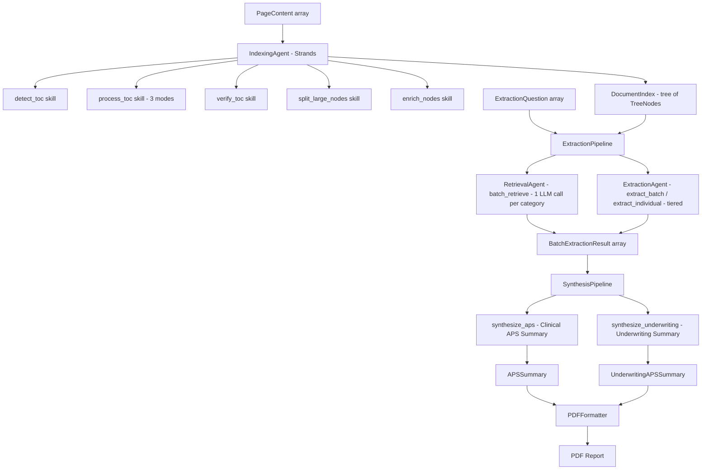
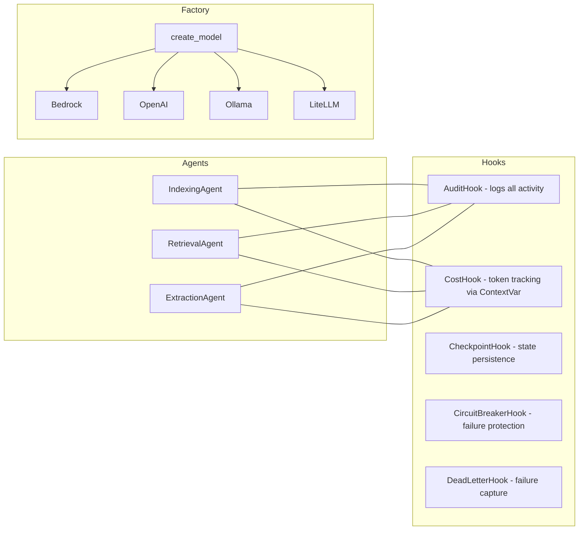
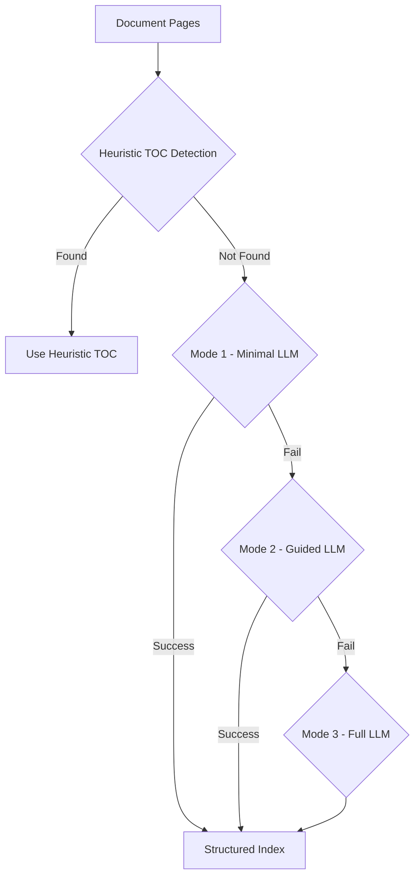
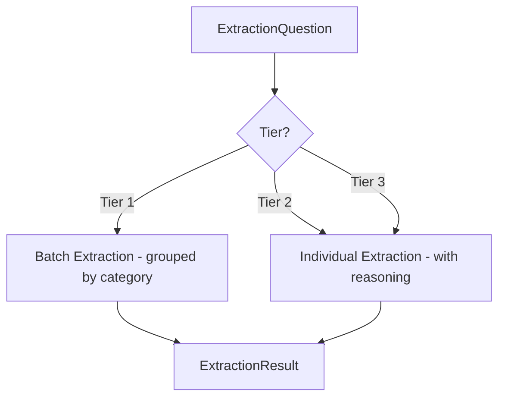
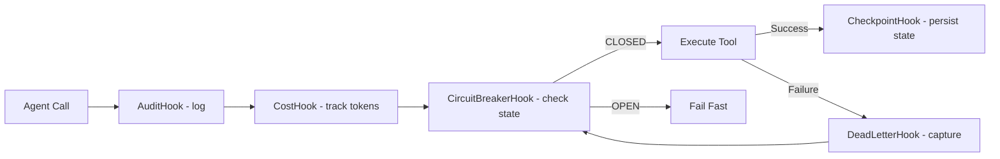
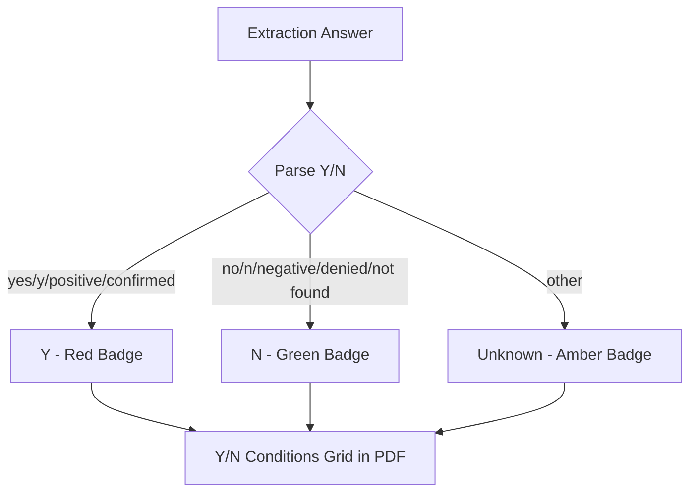
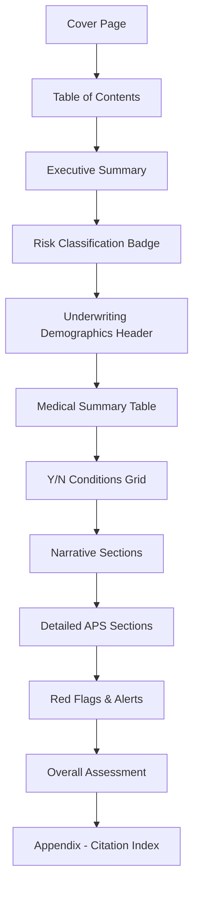

# Scout AI — Vectorless RAG for Medical Document Intelligence

## Overview

Scout AI is a **vectorless Retrieval-Augmented Generation (RAG)** system that builds hierarchical tree indexes from pre-OCR'd document pages and uses LLM reasoning for retrieval — no embeddings or vector databases required. It is purpose-built for extracting structured clinical and underwriting data from **Attending Physician Statements (APS)** and similar medical documents.

Orchestrated by the **Strands Agents SDK** with lifecycle hooks for observability, cost tracking, and resilience.

---

## Architecture

### Data Flow



### Agent Architecture



### Indexer Fallback Cascade



### Extraction Tiers



---

## Directory Structure

```
src/scout_ai/
├── __init__.py                   # Public API (legacy + Strands-era exports)
├── config.py                     # Legacy ScoutSettings
├── models.py                     # All Pydantic data models
├── exceptions.py                 # Exception hierarchy
│
├── core/                         # Strands-era foundation
│   ├── config.py                 # Nested AppSettings (LLM, indexing, extraction, etc.)
│   ├── types.py                  # Type aliases (JsonDict, PageMap, etc.)
│   └── exceptions.py             # Extended exceptions (re-exports originals)
│
├── agents/                       # Strands Agent factories
│   ├── factory.py                # create_model() — provider switch
│   ├── indexing_agent.py         # create_indexing_agent(settings)
│   ├── retrieval_agent.py        # create_retrieval_agent(settings)
│   ├── extraction_agent.py       # create_extraction_agent(settings)
│   └── orchestrator.py           # ExtractionPipeline — retrieve → extract
│
├── skills/                       # @tool-decorated Strands skills
│   ├── common/                   # Shared: json_parser, token_counter
│   ├── indexing/                  # detect_toc, process_toc, verify_toc, etc.
│   ├── retrieval/                # tree_search, batch_retrieve
│   └── extraction/               # extract_batch, extract_individual
│
├── hooks/                        # Strands HookProvider implementations
│   ├── audit_hook.py             # Logs every LLM call + tool execution
│   ├── cost_hook.py              # Token usage accumulator (ContextVar)
│   ├── checkpoint_hook.py        # Pipeline state checkpointing for resume
│   ├── circuit_breaker_hook.py   # CLOSED → OPEN → HALF_OPEN failure protection
│   ├── dead_letter_hook.py       # Failed tool capture for later analysis
│   ├── tracing.py                # OpenTelemetry OTLP setup
│   └── logging_config.py         # structlog configuration
│
├── prompts/                      # Prompt registry + templates
│   ├── registry.py               # get_prompt(domain, category, name)
│   └── templates/
│       ├── base/                  # Agent system prompts
│       └── aps/                   # APS domain prompts
│
├── domains/                      # Domain-specific modules
│   └── aps/                      # APS (Attending Physician Statement)
│       ├── __domain__.py         # Domain manifest (auto-discovered by DomainRegistry)
│       ├── models.py             # APSSummary, UnderwritingAPSSummary, YNCondition
│       ├── categories.py         # 16 base + 15 underwriting category descriptions
│       ├── section_patterns.py   # Regex patterns for section detection
│       ├── classifier.py         # MedicalSectionClassifier (regex-first, LLM fallback)
│       ├── questions/            # Question templates (JSON)
│       │   └── underwriting_template.json  # 47 questions, 15 categories
│       ├── synthesis/            # Deterministic post-processing
│       │   └── pipeline.py       # SynthesisPipeline (synthesize_aps, synthesize_underwriting)
│       └── formatters/           # Output formatters
│           ├── pdf_formatter.py  # PDFFormatter (APS + Underwriting templates)
│           └── pdf_styles.py     # Colors, display names, layout constants
│
├── synthesis/                    # Generic synthesis models
│   └── models.py                 # APSSummary, SynthesisSection, UnderwriterSummary, etc.
│
├── formatters/                   # Generic formatter interface
│   └── pdf_formatter.py          # Base PDFFormatter class
│
├── persistence/                  # Pluggable storage backends
│   ├── protocols.py              # IPersistenceBackend Protocol
│   ├── file_backend.py           # Local JSON file storage
│   ├── s3_backend.py             # AWS S3 storage
│   └── memory_backend.py         # Dict-backed (for tests)
│
├── providers/pageindex/          # Legacy provider implementations (still functional)
│   ├── client.py                 # LLMClient (AsyncOpenAI wrapper)
│   ├── indexer.py                # ScoutIndexer (3-mode cascade)
│   ├── retrieval.py              # ScoutRetrieval
│   ├── batch_retrieval.py        # BatchRetrieval (category-grouped)
│   ├── chat.py                   # ScoutChat (tiered extraction with type hints)
│   ├── tree_builder.py           # Tree construction
│   ├── tree_utils.py             # Tree traversal utilities
│   └── tokenizer.py              # Token counter (3 backends)
│
├── services/                     # Legacy orchestration layer
│   ├── extraction_service.py     # Wires retrieval → chat
│   ├── ingestion_service.py      # Wires indexer → IndexStore
│   └── index_store.py            # JSON file persistence
│
├── api/                          # FastAPI HTTP layer
│   ├── app.py                    # Application with lifespan
│   ├── routes/                   # health, index, retrieve, extract
│   └── middleware/               # Error handler
│
└── cli/main.py                   # Typer CLI: index, retrieve, extract
```

---

## Key Design Patterns

### 1. Strands Agent Architecture
Each agent (indexing, retrieval, extraction) is created via a factory function that takes `AppSettings`, builds the appropriate Strands `Agent` with `@tool` skills and `HookProvider` hooks.

### 2. Skill Decomposition
Each `@tool` returns JSON instructions for the agent to reason over. Companion pure-logic functions (`*_sync`, `resolve_*`, `parse_*`) handle deterministic post-processing without LLM calls.

### 3. Hook Lifecycle



### 4. Domain Registry
Convention-based domain modules discovered by `DomainRegistry`. Each domain provides a `__domain__.py` manifest with category descriptions, question templates, and formatters.

### 5. Pluggable Persistence
`IPersistenceBackend` Protocol with file, S3, and memory implementations. Tests use in-memory backend.

### 6. Legacy Backward Compatibility
All original imports from `scout_ai.*` still work. Old `aps/` and `providers/pageindex/medical_classifier.py` files are thin re-export shims.

---

## Underwriting Template System

### Question Categories (47 questions across 15 categories)

| Category | Questions | Type | Purpose |
|----------|-----------|------|---------|
| `demographics` | 5 | text/date | Name, DOB, Gender, Policy#, Date Range |
| `encounter_history` | 3 | list/text | Visit dates, most recent, total count |
| `vital_signs` | 4 | list/text | BP readings+dates, BMI, Height/Weight, trends |
| `lab_results` | 4 | list/text | All labs with ranges, critical values, HbA1c, lipids |
| `current_medications` | 3 | list/boolean | Meds+dosage, currently taking?, controlled substances |
| `diagnoses` | 3 | list/boolean | Conditions+dates, chronic status, specialist referrals |
| `procedures` | 2 | list/boolean | Procedures+outcomes, complications |
| `medical_history` | 2 | text | Complete past history, additional history |
| `substance_use_history` | 3 | boolean_with_detail | Alcohol (2yr), Tobacco, Drug use (3yr) |
| `critical_medical_conditions` | 7 | boolean_with_detail | Dementia, CVA, MI, Dialysis, Cancer, Valve, AIDS |
| `mental_health_conditions` | 3 | boolean_with_detail | Disability, Suicide attempt, Psych hospitalization |
| `other_critical_conditions` | 2 | boolean_with_detail | Cirrhosis, Gastric Bypass (6mo) |
| `morbidity_concerns` | 2 | text | Morbidity risk factors, future risk |
| `mortality_concerns` | 2 | text | Mortality risk factors, life-threatening conditions |
| `residence_travel` | 2 | boolean_with_detail | Foreign residence, travel concerns |

### Y/N Condition Processing



### PDF Output Structure

The underwriting PDF follows the same structure as the clinical APS PDF:



---

## Configuration

All settings use pydantic-settings with environment variable prefixes:

| Prefix | Config Class | Purpose |
|--------|-------------|---------|
| `SCOUT_LLM_` | `LLMConfig` | Model provider, API key, temperature |
| `SCOUT_INDEXING_` | `IndexingConfig` | TOC detection, node limits |
| `SCOUT_ENRICHMENT_` | `EnrichmentConfig` | Summary, classification toggles |
| `SCOUT_RETRIEVAL_` | `RetrievalConfig` | Concurrency, top-k |
| `SCOUT_EXTRACTION_` | `ExtractionConfig` | Context limits, batch size |
| `SCOUT_PERSISTENCE_` | `PersistenceConfig` | Backend type, S3 bucket |
| `SCOUT_TOKENIZER_` | `TokenizerConfig` | Counter method |
| `SCOUT_OBSERVABILITY_` | `ObservabilityConfig` | Tracing, OTLP endpoint, log level |
| `SCOUT_PDF_` | `PDFFormattingConfig` | PDF output formatting |

---

## Build & Development

```bash
# Install (editable, with dev tools)
pip install -e ".[dev]"

# Install with optional extras
pip install -e ".[dev,api,otel,s3,pdf]"

# Run all tests (no LLM required)
pytest tests/ -v

# Unit tests only
pytest tests/unit/ -v

# Integration tests only (mocked LLM via respx)
pytest tests/integration/ -v

# Lint
ruff check src/ tests/

# Type check
mypy src/

# Run API server locally
uvicorn scout_ai.api.app:app --host 0.0.0.0 --port 8080

# Generate underwriting demo PDF
python3 /tmp/run_underwriting_demo.py
```

---

## Deployment Targets

| Target | Directory | Notes |
|--------|-----------|-------|
| AWS ECS (Fargate) | `deploy/ecs/` | Task definition + service config |
| AWS EKS | `deploy/eks/` | Deployment, service, configmap, HPA |
| RHEL on-premise | `deploy/rhel/` | systemd unit, install script, logrotate |
| Docker | `docker/` | Production (RHEL UBI 9) and dev Dockerfiles |

---

## Test Infrastructure

- **390 tests** across unit and integration suites
- All async tests use `asyncio_mode = "auto"`
- Integration tests mock the OpenAI API at the HTTP level using `respx`
- Test fakes: `FakeStrandsModel` (canned responses), `FakePersistenceBackend` (dict-backed)
- PDF tests use `pytest.importorskip("reportlab")` for optional dependency

---

## Code Style

- **Line length**: 120 (ruff configured)
- **Target Python**: 3.10+
- **Ruff rules**: E, F, I, W
- **mypy**: strict mode enabled
- **Imports**: `from __future__ import annotations` in all modules
- **Abstractions**: Protocol-based (not ABC inheritance)
- **Optional deps**: lazy imports with clear error messages
