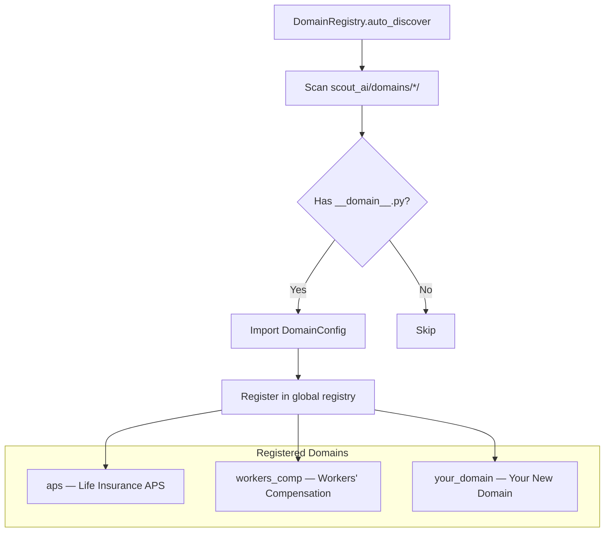
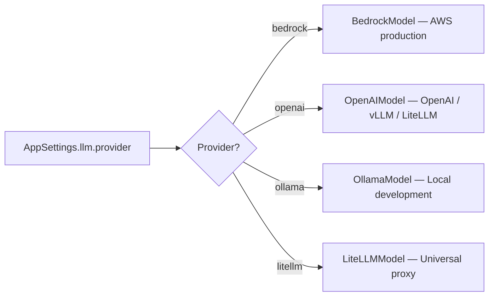
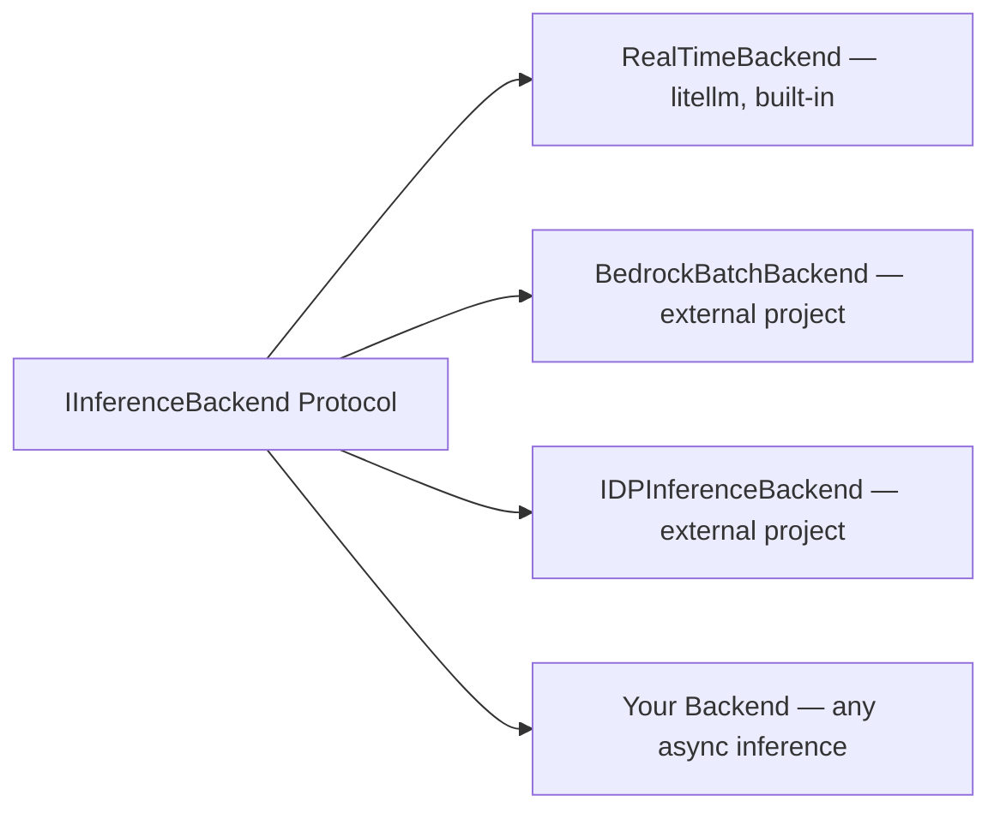
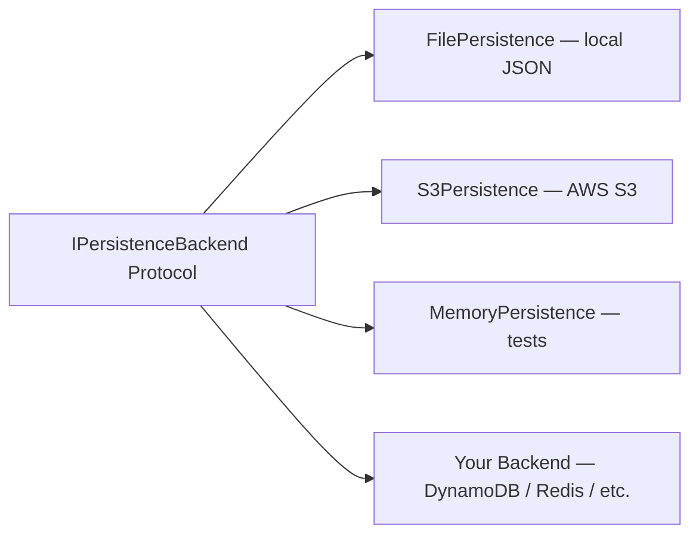
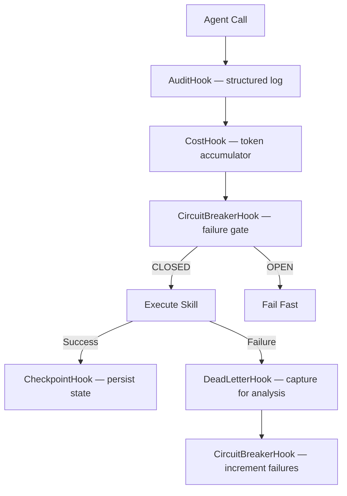
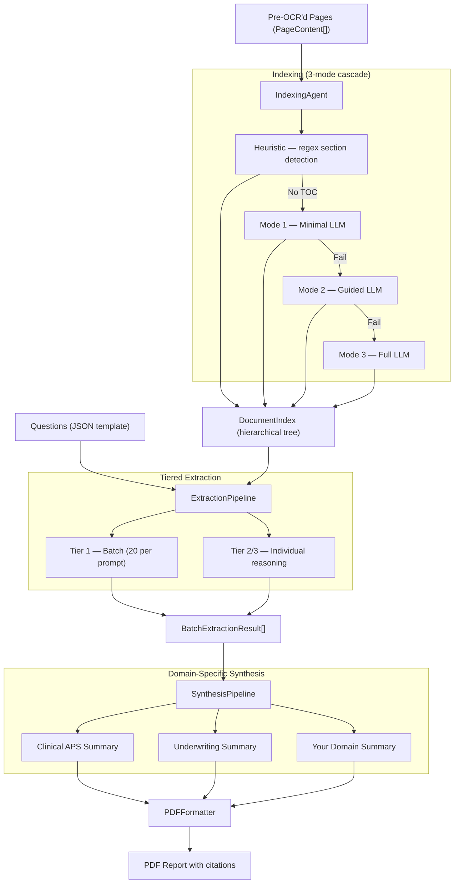

# Scout AI — Enterprise Document Intelligence Platform

> **Ameritas Enterprise Seed Project** — A reusable, extensible foundation for building document extraction and analysis solutions across business lines.

Scout AI is a **vectorless Retrieval-Augmented Generation (RAG)** platform that builds hierarchical tree indexes from pre-OCR'd document pages and uses LLM reasoning for retrieval and extraction — no embeddings or vector databases required. It ships with a production-ready **APS (Attending Physician Statement)** domain for life insurance underwriting, and is designed from day one to be forked and extended for any document-heavy workflow at Ameritas.

---

## Why This Exists

Ameritas processes thousands of structured and semi-structured documents across life insurance, dental, vision, disability, and retirement services. Each line of business has its own document types, extraction categories, synthesis logic, and reporting formats — but the underlying RAG mechanics (index, retrieve, extract, synthesize, format) are identical.

**Without a seed project**, every team builds its own:
- Document parsing pipeline
- LLM integration layer
- Question/answer extraction framework
- PDF report generation
- Observability and cost tracking
- Deployment configs

**With Scout AI as the seed**, teams inherit all of that and only write what's unique to their domain: questions, categories, synthesis rules, and output templates.

---

## Enterprise Reusability

### What You Get Out of the Box

| Capability | Implementation | Reuse Level |
|---|---|---|
| Document indexing | 3-mode cascade (heuristic → guided LLM → full LLM) | Direct reuse |
| Tree-based retrieval | LLM-reasoned search over hierarchical index | Direct reuse |
| Tiered extraction | Batch (Tier 1) + individual reasoning (Tier 2/3) | Direct reuse |
| LLM provider switching | Bedrock, OpenAI, Ollama, LiteLLM, vLLM | Direct reuse |
| Pluggable inference | Real-time (built-in), Bedrock Batch, IDP adapters via env var | Direct reuse |
| Observability | Audit logging, token cost tracking, OpenTelemetry | Direct reuse |
| Resilience | Circuit breaker, dead letter queue, checkpointing | Direct reuse |
| Persistence | File, S3, in-memory backends via Protocol | Direct reuse |
| Context engineering | Prefix stabilization, compression, factoring, result caching | Direct reuse |
| PDF generation | reportlab-based with configurable styles | Extend per domain |
| Synthesis pipeline | Deterministic post-processing framework | Extend per domain |
| Question templates | JSON-driven, category-grouped | **New per domain** |
| Category descriptions | Dict-based retrieval hints for the LLM | **New per domain** |
| Section classifiers | Regex-first, LLM fallback | **New per domain** |

### The 80/20 Rule

For a typical new domain, **~80% of the codebase is reused unchanged**. The ~20% you write:

1. **`__domain__.py`** — A manifest file (~30 lines) declaring your domain name, categories, formatters, and dotted-path references
2. **`categories.py`** — Category descriptions that tell the retrieval LLM where to look in documents
3. **`questions/*.json`** — Your extraction questions (the "what to extract" specification)
4. **`models.py`** — Domain-specific data models (e.g., `YNCondition` for underwriting, `InjuryDetail` for workers' comp)
5. **`synthesis/pipeline.py`** — Deterministic logic that transforms raw extraction results into structured summaries
6. **`formatters/`** — PDF/JSON templates for your output reports

Everything else — the agents, hooks, persistence, providers, API layer, CLI, Docker configs — works as-is.

---

## Extensibility Architecture

### Domain Registry (Convention-Based Auto-Discovery)



To add a new domain, create a package under `src/scout_ai/domains/` with a `__domain__.py`:

```python
# src/scout_ai/domains/disability/__domain__.py
from scout_ai.domains.registry import DomainConfig
from scout_ai.domains.disability.categories import CATEGORY_DESCRIPTIONS

domain = DomainConfig(
    name="disability",
    display_name="Disability Claims",
    description="Disability claim document extraction and analysis",
    category_descriptions=CATEGORY_DESCRIPTIONS,
    prompts_module="scout_ai.domains.disability.prompts",
    synthesis_pipeline="scout_ai.domains.disability.synthesis:DisabilitySynthesis",
    formatters={"pdf": "scout_ai.domains.disability.formatters:DisabilityPDFFormatter"},
)
```

That's it. The registry discovers it at startup. No wiring code, no factory edits, no config changes.

### Pluggable LLM Providers



Switch providers with a single environment variable. No code changes. Local dev uses Ollama; staging uses vLLM behind LiteLLM; production uses Bedrock.

### Pluggable Inference Backends



Switch inference backends with one env var — no code changes:

```bash
# Default — current real-time behavior
export SCOUT_LLM_INFERENCE_BACKEND=realtime

# Bedrock Batch (external project, dotted-path import)
export SCOUT_LLM_INFERENCE_BACKEND=ameritas_bedrock_batch.backend:BedrockBatchBackend
```

External backends implement two async methods (`infer`, `infer_batch`) and receive `AppSettings` for self-configuration. The factory uses the same dotted-path loading pattern as the Domain Registry.

### Pluggable Persistence



Implement 5 methods (`save`, `load`, `exists`, `delete`, `list_keys`) and your backend works everywhere.

### Hook Lifecycle (Observability Without Code Changes)



Every agent gets audit logging, cost tracking, circuit breaking, and dead letter capture for free. Add domain-specific hooks by implementing the `HookProvider` interface.

---

## Use Cases at Ameritas

### Currently Implemented

| Domain | Status | Description |
|---|---|---|
| **APS — Clinical** | Production-ready | Extract demographics, medical history, labs, medications, diagnoses from Attending Physician Statements |
| **APS — Underwriting** | Production-ready | 47-question underwriting template with Y/N conditions, morbidity/mortality assessment, dated vitals, and page-referenced PDF reports |
| **Workers' Comp** | Scaffold | Category definitions and models in place; questions and synthesis TBD |

### Candidate Use Cases

| Business Line | Document Type | Extraction Need |
|---|---|---|
| **Dental Claims** | EOBs, treatment plans, X-ray reports | Procedure codes, tooth numbers, pre-authorization status |
| **Vision Claims** | Optical prescriptions, exam reports | Rx values, diagnosis codes, medical necessity |
| **Disability** | Functional capacity evals, employer statements | Restrictions, work capacity, duration estimates |
| **Retirement Services** | Beneficiary forms, hardship applications | Eligibility verification, compliance checks |
| **Compliance** | Regulatory filings, audit responses | Policy adherence, gap identification |
| **Group Benefits** | Enrollment forms, census data | Member demographics, plan elections, dependent verification |

Each of these follows the same pattern: define questions, describe categories, write synthesis logic, design the output template. The RAG infrastructure, LLM orchestration, observability, and deployment are already solved.

---

## Getting Started (New Domain)

### Step 1: Fork the Seed

```bash
git clone https://github.com/ksinha49/aps.git my-domain-project
cd my-domain-project
pip install -e ".[dev]"
pytest tests/ -v  # Verify 613+ tests pass
```

### Step 2: Create Your Domain Package

```
src/scout_ai/domains/my_domain/
├── __init__.py
├── __domain__.py          # Domain manifest (see example above)
├── categories.py          # Category descriptions for retrieval
├── models.py              # Domain-specific data models
├── questions/
│   └── template.json      # Your extraction questions
├── synthesis/
│   └── pipeline.py        # Deterministic post-processing
└── formatters/
    ├── pdf_formatter.py   # PDF template (extends base PDFFormatter)
    └── pdf_styles.py      # Colors, display names, layout constants
```

### Step 3: Define Your Questions

```json
[
  {
    "question_id": "my-001",
    "category": "patient_info",
    "question_text": "What is the patient's full name?",
    "tier": 1,
    "expected_type": "text"
  },
  {
    "question_id": "my-002",
    "category": "diagnosis",
    "question_text": "Does the patient have a confirmed diagnosis of X?",
    "tier": 2,
    "expected_type": "boolean_with_detail"
  }
]
```

### Step 4: Write Category Descriptions

```python
# categories.py
CATEGORY_DESCRIPTIONS = {
    "patient_info": "Patient demographics, identifiers, and contact information...",
    "diagnosis": "Clinical diagnoses, ICD codes, onset dates, and severity...",
}
```

### Step 5: Run It

```bash
# Build index from your documents
scout-ai index pages.json --doc-id doc-001 --output index.json

# Extract answers
scout-ai extract index.json questions.json --output results.json
```

---

## Data Flow



---

## Configuration

All settings use pydantic-settings with environment variable prefixes. No config files to manage.

| Prefix | Purpose | Example |
|---|---|---|
| `SCOUT_LLM_` | LLM provider, model, temperature, inference backend | `SCOUT_LLM_INFERENCE_BACKEND=realtime` |
| `SCOUT_INDEXING_` | TOC detection, node limits | `SCOUT_INDEXING_MAX_PAGES_PER_NODE=4` |
| `SCOUT_EXTRACTION_` | Batch size, context limits | `SCOUT_EXTRACTION_BATCH_SIZE=20` |
| `SCOUT_PERSISTENCE_` | Backend type, S3 bucket | `SCOUT_PERSISTENCE_BACKEND=s3` |
| `SCOUT_OBSERVABILITY_` | Tracing, log level | `SCOUT_OBSERVABILITY_OTLP_ENDPOINT=...` |
| `SCOUT_PDF_` | Page size, fonts, watermark | `SCOUT_PDF_PAGE_SIZE=letter` |
| `SCOUT_COMPRESSION_` | Context compression | `SCOUT_COMPRESSION_METHOD=entropic` |
| `SCOUT_PREFIX_` | Prefix stabilization | `SCOUT_PREFIX_SORT_STRATEGY=page_number` |
| `SCOUT_CONTEXT_CACHE_` | Extraction result caching | `SCOUT_CONTEXT_CACHE_BACKEND=memory` |

---

## Build & Development

```bash
# Install (editable, with all extras)
pip install -e ".[dev,api,otel,s3,pdf]"

# Run all tests (no LLM required — mocked via respx)
pytest tests/ -v

# Lint + type check
ruff check src/ tests/
mypy src/

# Run API server
uvicorn scout_ai.api.app:app --host 0.0.0.0 --port 8080

# Generate underwriting demo PDF
python3 /tmp/run_underwriting_demo.py
```

Python 3.10+ required.

---

## Deployment

| Target | Config | Notes |
|---|---|---|
| **AWS ECS (Fargate)** | `deploy/ecs/` | Task definition + service config |
| **AWS EKS** | `deploy/eks/` | Deployment, service, configmap, HPA |
| **RHEL On-Premise** | `deploy/rhel/` | systemd unit, install script, logrotate |
| **Docker** | `docker/` | Production (RHEL UBI 9) + dev compose |

---

## Repository Structure

```
├── src/scout_ai/           # Core library
│   ├── agents/             # Strands agent factories
│   ├── skills/             # @tool-decorated agent skills
│   ├── hooks/              # Observability & resilience hooks
│   ├── domains/            # Domain modules (auto-discovered)
│   │   ├── aps/            # APS domain (production-ready)
│   │   └── workers_comp/   # Workers' comp (scaffold)
│   ├── context/            # Context engineering (compression, caching, prefix, factoring)
│   ├── inference/          # Pluggable inference backends (Protocol-based)
│   ├── persistence/        # Storage backends (Protocol-based)
│   ├── providers/          # Legacy provider implementations
│   ├── prompts/            # Prompt registry + templates
│   ├── api/                # FastAPI HTTP layer
│   └── cli/                # Typer CLI
├── tests/
│   ├── unit/               # 300+ unit tests
│   ├── integration/        # Mocked LLM integration tests
│   └── fakes/              # FakeStrandsModel, FakePersistenceBackend, FakeInferenceBackend, FakeContextCache
├── deploy/                 # ECS, EKS, RHEL deployment configs
├── docker/                 # Production + dev Dockerfiles
├── PROJECT.md              # Detailed architecture documentation
└── CLAUDE.md               # AI assistant guidance
```

---

## License

Internal — Ameritas Enterprise
